<div align="center">

# 🍀 ClovaSet

### 특별한 날, 가까운 옷장

**한 번의 외출을 위해 사기엔 아까운 옷.**  
**이제 가까운 이웃의 옷장에서 만나보세요.**

특별한 날에만 입는 옷을 동네 이웃과 빌려주고 빌리는 의류 대여 서비스

[](http://211.233.206.104/)
[](https://github.com/haramj/ClovaSet)


[프로젝트 소개](#about) · [화면과 기능](#experience) · [시스템 구성](#architecture) · [실행 방법](#quick-start) · [시연 안내](#demo)

</div>

---

<a id="about"></a>

## 옷장에 머무는 옷을, 누군가의 특별한 하루로

결혼식에 입을 정장, 파티를 위한 옷, 평소와 다른 분위기를 내고 싶은 날의 한 벌.  
ClovaSet은 **가끔 필요한 옷을 가까운 이웃과 나누는 경험**을 제안합니다.

| 빌리는 사람에게 | 빌려주는 사람에게 |
| :--- | :--- |
| 필요한 날에 맞는 옷을 동네에서 탐색 | 자주 입지 않는 옷을 내 옷장에 등록 |
| 용도와 지역으로 후보를 좁히기 | 사진·가격·대여 가능 기간을 직접 설정 |
| 마음에 드는 옷을 찜하고 대여 요청 | 요청한 이웃과 채팅으로 대화 |

> **현재 개발 단계 · 기능 시연용 프로토타입**  
> 의류 등록·사진·대여 요청 채팅을 구현했습니다. 계정 인증, 실제 예약 확정 및 결제는 현재 시연 범위에 포함되지 않습니다.

<a id="experience"></a>

## 화면으로 따라가는 ClovaSet

아래 이미지는 실제 시연 서버에서 촬영한 화면입니다. 동네 옷장 이용에는 시연 접속 코드가 필요합니다.

### 01 — 랜딩 · 서비스와의 첫 만남

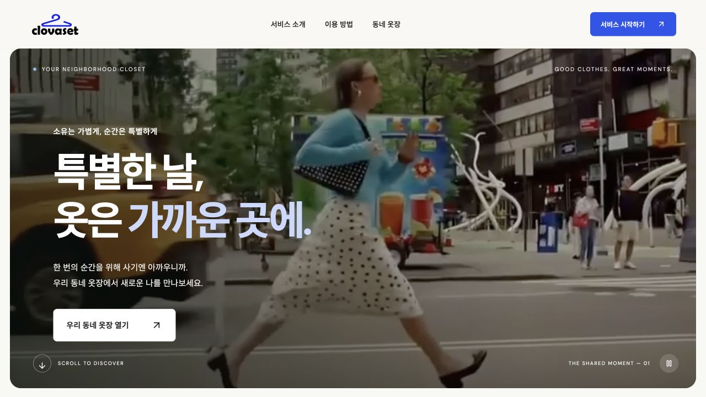

| 서비스 소개 | 스타일 카테고리 |
| :---: | :---: |
| 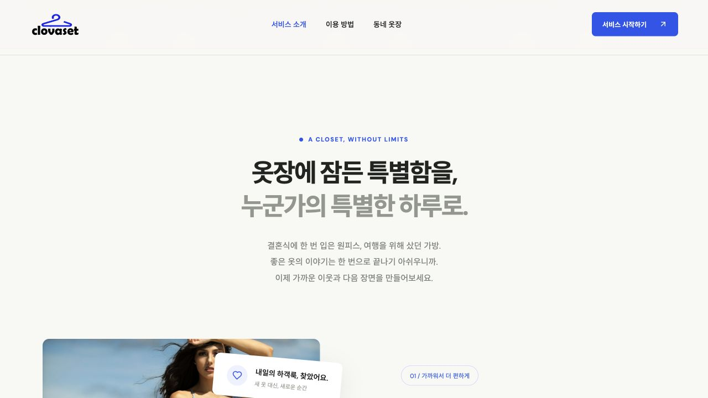 | 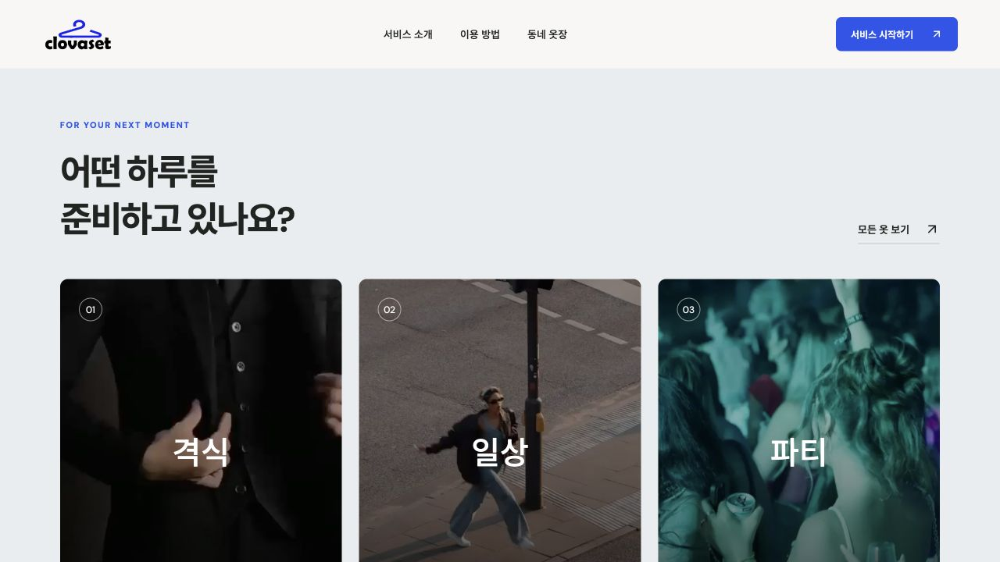 |

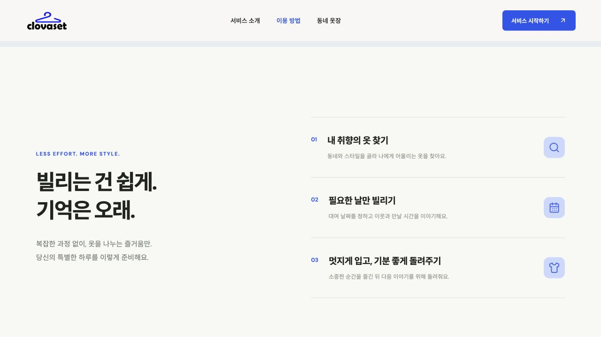

시네마틱 랜딩에서 서비스를 만나고, **서비스 시작하기**를 눌러 동네 옷장으로 이동합니다.

### 02 — 동네 옷장 · 오늘 필요한 한 벌 찾기

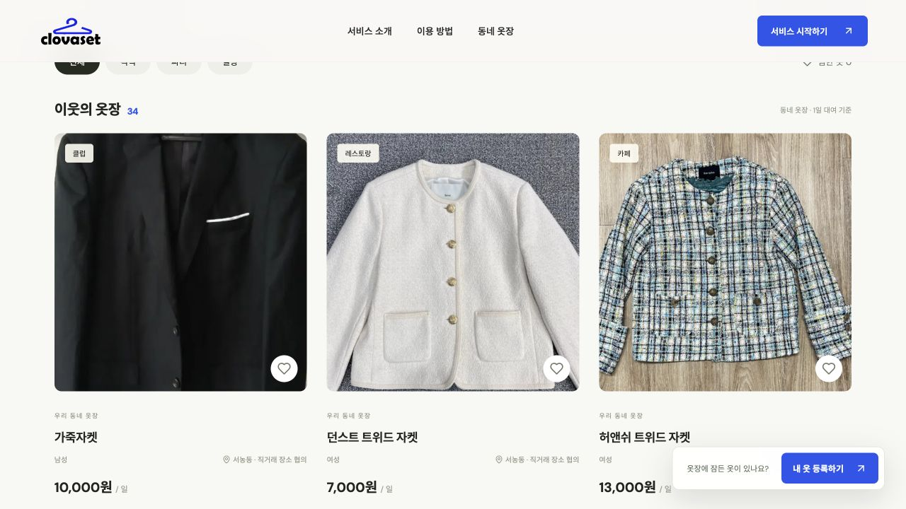

| 화면 요소 | 할 수 있는 일 |
| :--- | :--- |
| 의류 목록 | 등록된 옷을 살펴보기 |
| 카테고리·용도 필터 | 남성/여성, 격식·파티·일상 및 세부 용도로 탐색 |
| 동네 필터 | 서농동 기준으로 목록 좁히기 |
| 찜 | 관심 있는 옷을 브라우저에 보관 |

### 03 — 내 옷 등록 · 왼쪽 슬라이드 패널에서 간편하게

| 분류·용도 선택 | 옷 소개·사진 입력 |
| :---: | :---: |
| 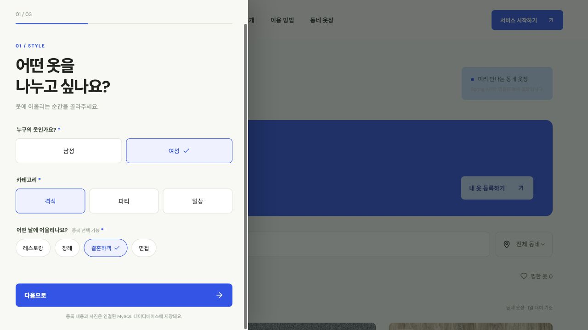 | 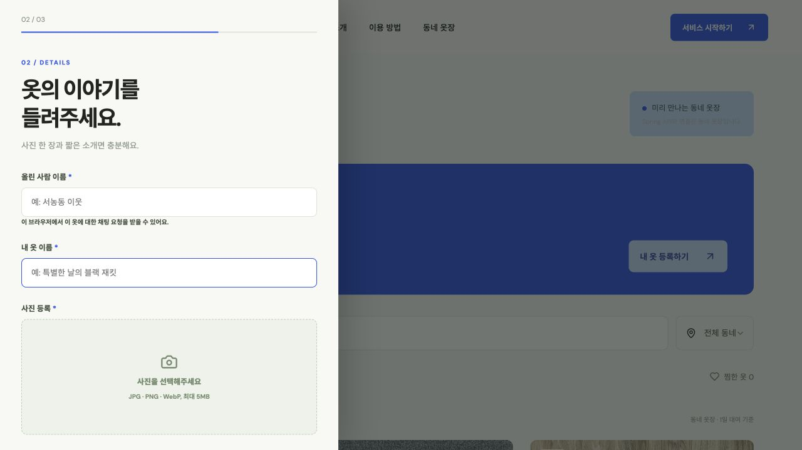 |

**서비스 시작하기 → 내 옷 등록하기**에서 등록을 시작합니다.

| 순서 | 입력 항목 | 상세 |
| :---: | :--- | :--- |
| **1** | 분류와 용도 | 남성/여성 → 격식·파티·일상 → 세부 용도 복수 선택 |
| **2** | 옷 소개 | 옷 이름, 사진, 설명 |
| **3** | 대여 조건 | 1일 대여 가격, 대여 가능 시작일·종료일 |
| **4** | 위치 | **내 위치** 버튼으로 시연용 동네 설정 |
| **5** | 등록 | 옷장 목록·카테고리·서농동 필터에 바로 반영 |

사진은 **JPG / PNG / WebP, 최대 5MB**를 지원합니다.  
위치는 시연용으로 **경기도 용인시 기흥구 서농동**을 표시하며, GPS나 실제 위치 권한은 사용하지 않습니다.

### 04 — 대여 요청과 나의 채팅 · 이웃과 대화 시작하기

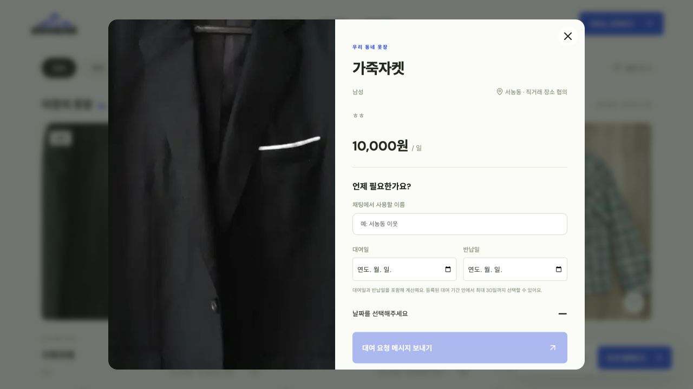

<details>
<summary>나의 채팅 목록 화면</summary>

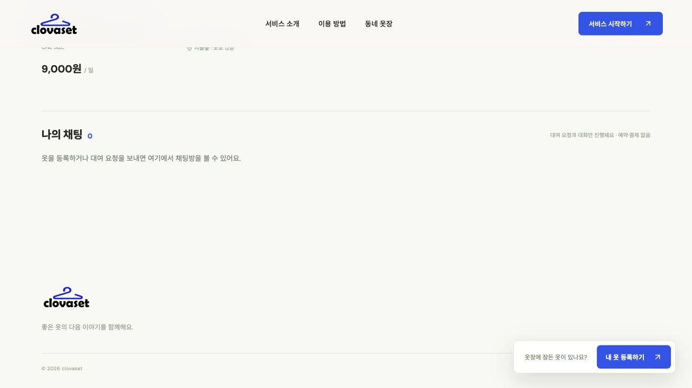

새 브라우저에서 접속한 상태로, 아직 참여한 채팅방이 없는 화면입니다.

</details>

새로 등록한 옷에는 등록 브라우저의 소유자 정보가 연결됩니다. 다른 브라우저에서 대여를 요청하면, 양쪽의 **나의 채팅**에서 같은 대화를 확인할 수 있습니다.

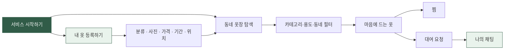

> 소유자를 식별할 수 없는 예시 상품과 이전 등록 상품은 브라우저에만 저장되는 **시연용 채팅**으로 연결됩니다. 해당 메시지는 실제 소유자에게 전송되지 않습니다.

<a id="architecture"></a>

## 서비스 구성

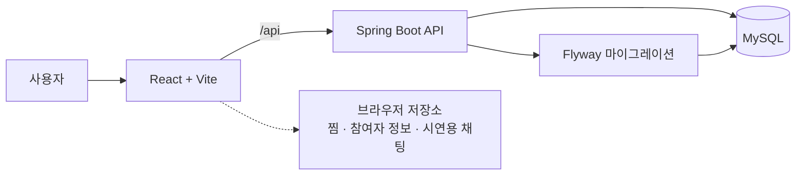

| 영역 | 기술 | 역할 |
| :--- | :--- | :--- |
| Frontend | React · Vite | 랜딩, 의류 탐색·등록, 찜, 채팅 UI |
| Backend | Spring Boot 4.0.8 · Java 17+ | 의류·사진·대여 요청 채팅 API |
| Database | MySQL 8.4.11 · Flyway | 데이터 영속화 및 스키마 마이그레이션 |
| Infrastructure | Docker Compose | 로컬 및 임시 시연 환경 구성 |
| CI/CD | GitHub Actions · GitHub Pages | 검사와 정적 웹 배포 |
| Development | OpenCode · HyperCLOVA X | 개발 도구 설정 |

등록된 의류·사진·소유자 연결 채팅은 **Spring API를 통해 MySQL에 저장**합니다. 브라우저에는 참여자 식별자·표시 이름, 찜, 시연용 채팅이 저장됩니다. 참여자 식별자는 브라우저별로 생성되므로 브라우저 저장소를 지우면 이전 채팅에 접근할 수 없습니다.

```text
ClovaSet/
├── apps/
│   ├── web/                  # React + Vite 프론트엔드
│   └── api/                  # Spring Boot 백엔드
├── packages/shared/src/     # 공유 코드
├── database/                # 데이터베이스 관련 파일
├── docs/                    # 프로젝트 문서
├── infra/                   # 인프라 관련 파일
├── scripts/                 # 개발·시연 스크립트
├── tests/                   # 테스트
├── .github/workflows/       # CI/CD 워크플로
├── compose.yaml             # 로컬 실행 구성
└── compose.demo.yaml        # 임시 시연 실행 구성
```

<a id="quick-start"></a>

## 로컬에서 실행하기

**준비:** Node.js 22.12+, Java 17+, Docker Desktop

### 1. 저장소 받기

```bash
git clone https://github.com/haramj/ClovaSet.git
cd ClovaSet
```

### 2. 데이터베이스와 API 실행

저장소 루트에서 실행합니다.

```bash
docker compose up -d mysql
cd apps/api
./mvnw spring-boot:run
```

### 3. 웹 실행

다른 터미널에서 저장소 루트를 기준으로 실행합니다.

```bash
cd apps/web
npm ci
npm run dev
```

**[http://127.0.0.1:5173/](http://127.0.0.1:5173/)** 에 접속합니다.

| 서비스 | 로컬 주소 | 비고 |
| :--- | :--- | :--- |
| Web | `http://127.0.0.1:5173` | Vite 개발 서버 |
| API | `http://127.0.0.1:8080` | Vite가 `/api` 요청을 전달 |
| MySQL | `127.0.0.1:3306` | 로컬 인터페이스에만 공개 |

첫 실행 시 Flyway가 테이블을 생성합니다. DB 기본 설정은 `compose.yaml`과 `apps/api/src/main/resources/application.yml`에 있으며, `DB_URL`, `DB_USERNAME`, `DB_PASSWORD` 환경 변수로 변경할 수 있습니다. 기본 비밀번호는 로컬 개발 전용입니다.

### 검사

```bash
# 저장소 루트: 개발 도구 설치 및 테스트
npm ci
npm test

# 백엔드 테스트
cd apps/api
./mvnw test
```

### 의류 API

| Method | Endpoint | 설명 |
| :--- | :--- | :--- |
| `GET` | `/api/clothes` | 의류 목록 조회 |
| `POST` | `/api/clothes` | 의류 등록: multipart `data`(JSON) + `photo`(이미지) |
| `GET` | `/api/clothes/{id}/photo` | 등록한 의류 사진 조회 |

<a id="demo"></a>

## 공개 데모와 구현 범위

**[공개 웹 열기](http://211.233.206.104/)** · **[배포 워크플로](https://github.com/haramj/ClovaSet/actions/workflows/web.yml)**

현재 시연 서버는 Spring API와 연결되어 있으며, 접속 코드 입력 후 동네 옷장과 등록 화면을 이용할 수 있습니다. GitHub Pages의 정적 웹 배포 구성도 별도로 지원합니다. 아래 표는 기능별 실행 조건을 정리합니다.

| 기능 | 동작 조건 |
| :--- | :--- |
| 랜딩·예시 의류 탐색 | 정적 웹에서 시연 |
| 찜 | 브라우저 `localStorage` 사용 |
| 의류 등록·사진 저장 | Spring API + MySQL 연결 필요 |
| 소유자와 대여 요청 채팅 | API 연결 및 소유자가 연결된 상품 필요 |
| 예시 상품 채팅 | 브라우저 내 시연용, 실제 소유자에게 전송되지 않음 |
| 계정·실제 예약·결제 | 현재 시연 범위에 미포함 |

공개용 API가 연결되지 않은 구성에서는 등록 버튼이 비활성화되며, 등록 데이터를 브라우저에 대신 저장하지 않습니다. 예시 상품의 가격·위치는 데모 데이터이고, 영상은 사진에 움직임을 적용한 모션 영상입니다.

### CI/CD

- PR에서 Spring API·MySQL 마이그레이션 테스트와 웹 빌드를 검사합니다.
- `main`에 푸시하면 검사 통과 후 GitHub Pages에 웹을 배포합니다.
- 웹 배포 파일에는 API 키, `.env`, OpenCode 설정을 포함하지 않습니다.

<details>
<summary><strong>공개 API 연결 설정</strong></summary>

공개용 서버가 준비되면 다음 값을 설정합니다.

| 설정 위치 | 환경 변수 | 값 |
| :--- | :--- | :--- |
| GitHub Actions 웹 빌드 | `VITE_API_URL` | `https://서버주소/api` |
| API 서버 | `WEB_ORIGIN` | `https://haramj.github.io` |

MySQL 데이터는 서버의 영구 볼륨 또는 관리형 MySQL에 저장합니다.

</details>

<details>
<summary><strong>접근 코드가 있는 임시 시연 서버</strong></summary>

`compose.demo.yaml`은 기존 로컬 DB와 분리된 MySQL 8.4.11 영구 볼륨을 생성합니다. API는 `127.0.0.1:8081`에만 열리며, 모든 `/api/` 요청에 시연 접속 코드가 필요합니다.

```bash
node scripts/prepare-demo-env.mjs
cd apps/api
./mvnw -DskipTests package
cd ../..
docker compose -f compose.demo.yaml --env-file .env.demo up -d --build
```

- 접속 코드: Git에 올리지 않는 `.env.demo`의 `DEMO_ACCESS_CODE`
- 시연 제한: 의류 등록 최대 50건, 채팅방 최대 100개
- 외부 공개: 인증된 터널 주소가 준비된 동안만 사용
- 웹 빌드: `VITE_API_URL=https://터널주소/api`, `VITE_DEMO_ACCESS_REQUIRED=true`
- 접근 코드는 웹 빌드에 포함하지 않음

임시 터널 주소는 재시작 시 바뀔 수 있고, 실행 컴퓨터가 꺼지면 외부 접근이 중단됩니다. MySQL 데이터는 Docker 영구 볼륨에 남습니다.

</details>

<details>
<summary><strong>OpenCode · HyperCLOVA X 개발 환경</strong></summary>

저장소 루트에서 실행합니다.

```bash
npm ci
cp .env.example .env
# .env에 CLOVASTUDIO_API_KEY 값을 입력
npm run opencode
```

`.env`에는 별도 보안 채널로 전달받은 키를 설정합니다.

```dotenv
CLOVASTUDIO_API_KEY=여기에_전달받은_키
```

`npm ci`는 고정 버전 OpenCode CLI를 설치하므로 전역 설치가 필요하지 않습니다. `npm run opencode`가 루트 `.env`를 읽고 `opencode.json`의 HyperCLOVA X 설정에 주입합니다. 일반 `opencode` 명령은 이 로더를 거치지 않으므로 npm 명령을 사용합니다.

`.env`는 Git에서 제외하고 템플릿만 공유합니다. 키에는 `VITE_` 접두사를 붙이지 않습니다.

```bash
npm run opencode -- --version
```

</details>

## 함께 만드는 사람들

ClovaSet은 코드와 코드 밖의 다양한 기여가 함께 모여 만들어졌습니다. 커밋에 드러나지 않는 기여도 소중하게 생각하며, 함께 만든 모든 팀원을 소개합니다.

| [Haram Jeong · @haramj](https://github.com/haramj) | [정우빈 · @jllgame00](https://github.com/jllgame00) | [@sy110345](https://github.com/sy110345) | [@d0ubleho](https://github.com/d0ubleho) |
| :---: | :---: | :---: | :---: |
| Team Member | Team Member | Team Member | Team Member |

## License

이 프로젝트는 [MIT License](LICENSE)를 따릅니다.

---

<div align="center">

**ClovaSet**  
특별한 날을 위한 선택, 가까운 옷장에서.

[서비스 둘러보기 ↗](http://211.233.206.104/)

</div>
